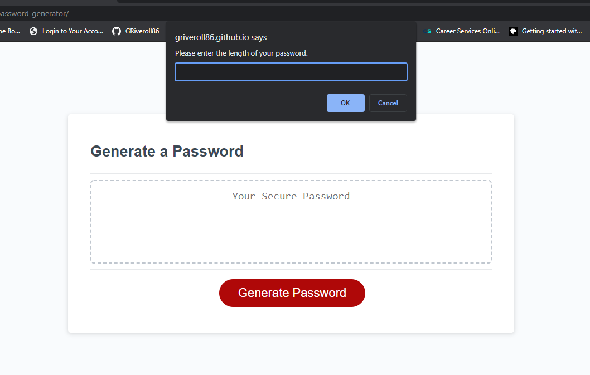

# Password Generator

## Random Password Generator
This assignment asked us to create a random password generator that creates a password based on four character types selected by the user with confirm/prompt functions, including password length, lower case letters, upper case letters, numbers and/or special characters. At least one character type must be selected and the length must be within 8 and 128.

## Files Edited
* script.js

## Website Preview

## Website Link
<https://griveroll86.github.io/password-generator/>